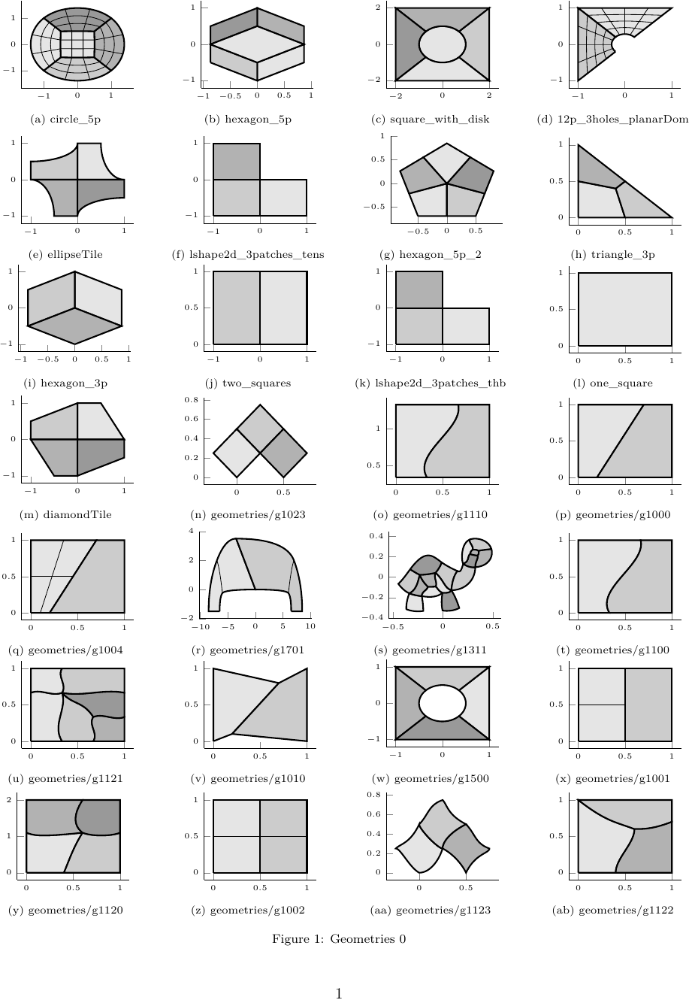

# gsUnstructuredSplines
Module for unstructured splines

# Changelog


# gsUnstructuredSplines

Module for the unstructured splines. The module is based on `gismo`'s Expression Assembler `gsExprAssembler`.

|CMake flags|```-DGISMO_gsUnstructuredSplines=ON``` (default ```OFF```)|
|--:|---|
|License|[MPL 2.0](https://www.mozilla.org/en-US/MPL/2.0/)|
|OS support|Linux, Windows, macOS|
|Build status| [CDash](link) |
|Repository|[gismo/gismo](https://github.com/gismo/gismo)|
|Status|completed|
|Developer|[Pascal Weinmueller](https://github.com/weinmueller),[Hugo Verhelst](https://github.com/hverhelst),[Andrea Farahat](https://github.com/AndreaFarahat)|
|Maintainer|[pascal.weinmueller@mtu.de](mailto:pascal.weinmueller@mtu.de),[h.m.verhelst@tudelft.nl](mailto:h.m.verhelst@tudelft.nl)|
|Last checked|21-10-2022|

#### Dependencies
No dependencies

#### Installation
```
cd path/to/build/dir
cmake . -DGISMO_gsUnstructuredSplines=ON
make
```

***

#### Overview of the `gsUnstructuredSplines` module
`gsAlmostC1`
* ...

`gsApproxC1Spline`
* ...

`gsC1SurfSpline`
* ...

#### Use of the `gsUnstructuredSplines` module
The `gsUnstructuredSplines` module consists of the classes
* `gsApproxC1Spline`: class that construct approximate C1 basis functions
* `gsSurfC1Spline`: 
* `gsDPatch`: 


#### Not (yet) supported:

#### Geometries:


